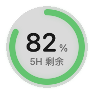

# Codex Usage Orb

一款只保留悬浮球的原生 macOS Codex 状态与用量工具。它能显示 Codex 是否正在工作，并在任务结束时发送系统通知。

## 界面预览

| 工作状态 | 5 小时剩余 | 每周剩余 |
| --- | --- | --- |
|  |  |  |

## 功能

- 始终置顶、跨桌面显示、可拖动
- Codex 工作时显示蓝色动态状态环
- 鼠标悬停显示任务标题、当前动作与持续时间
- 同时运行多个任务时在球内显示任务数量
- 任务完成或中断后发送 macOS 通知
- 空闲时显示 5 小时或每周窗口的剩余额度
- 不弹出卡片，左键点击不会改变悬浮球
- 绿色始终表示剩余量或成功完成
- 原生 SwiftUI、AppKit 毛玻璃，不需要后台服务器
- Universal 2：支持 Apple Silicon 与 Intel Mac

## 系统要求

- macOS 12 或更高版本
- 本机安装并使用过 Codex
- 首次启动时允许系统通知

## 安装

### 小白一键安装（推荐）

打开“终端”，复制下面这一整行，粘贴后按回车：

```bash
curl --http1.1 -fsSL --retry 5 --retry-all-errors https://raw.githubusercontent.com/aibo204/codex-usage-orb/main/install.sh | bash
```

它会下载源码、在你的 Mac 上本机编译、安装到个人“应用程序”目录并自动启动。所有 Codex 数据仍然只留在本机。首次使用如果弹出 Apple 命令行工具安装窗口，请完成安装，再运行一次上面的命令。

想先确认命令内容，可以直接查看 [`install.sh`](install.sh)。

### DMG 安装

也可以从 [Releases](../../releases) 下载最新 DMG，把 `Codex Usage Orb.app` 拖入“应用程序”。

免费发布版本没有 Apple Developer ID 公证。首次双击可能被 macOS 拦截；确认文件来自本仓库后，可先尝试打开一次，再前往“系统设置 → 隐私与安全性”，点击“仍要打开”。不要关闭 Gatekeeper。

## 从源码构建

安装 Xcode Command Line Tools：

```bash
xcode-select --install
```

然后执行：

```bash
git clone https://github.com/aibo204/codex-usage-orb.git
cd codex-usage-orb
chmod +x build-app.sh
./build-app.sh
open "dist/Codex Usage Orb.app"
```

构建脚本会生成同时支持 `arm64` 与 `x86_64` 的 Universal 2 应用。

## 数据与隐私

应用只读取当前用户目录中的：

- `~/.codex/sessions`：任务生命周期、进度与用量事件
- `~/.codex/session_index.jsonl`：本地任务标题

它不会读取 `auth.json`，不会收集 API Key，也不会把数据上传到网络。为了避免在界面和通知中暴露隐私，进度摘要会清理本地文件路径并限制长度。

这是本地日志观察器，不是 OpenAI 官方 usage API 客户端。Codex 日志格式未来发生变化时，解析逻辑可能需要同步更新。

## 开发与正式签名

```bash
./build-app.sh
```

项目还包含 `release.sh`，供拥有 Apple Developer Program 账号的维护者执行 Developer ID 签名、公证和票据装订；普通源码构建不需要付费账号。

## 许可证

[MIT](LICENSE)
